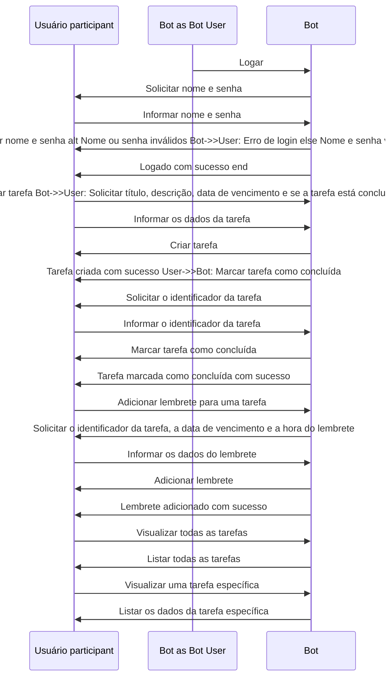

# Hello World To-do-bot!

Olá, amigos!

Digam olá para o **To-do-bot**! Um bot em *nodejs* que consumirá *APIs* de *IA* para ajudar a organizar e rastrear objetivos. Imagine só, um ~~assistente virtual~~ que sabe exatamente o que você precisa fazer, quando fazer e como fazer. Ele vai te lembrar das suas tarefas, te motivar, te dar feedback e até te elogiar quando você terminar. Não é incrível?

Mais incrível será compartilha todo o desenvolvimento com vocês! 

✨Um feliz 2024!
Que seja um ano incrível para *to-dos* vocês**✨

## Ajustes e melhorias
  

O projeto ainda está em desenvolvimento e as próximas atualizações serão voltadas nas seguintes tarefas:

  

 - [x] Concepção do Projeto
	 - [x] Definição do escopo
	 - [x] Análise dos requisitos
	 - [x] Planejamento
	 - [x] Estruturação do ambiente 
 
 - [ ] TO-DO
	 - [ ] Criar, editar, excluir e marcar como concluídas as tarefas.
	- [ ] Criar lembretes para tarefas específicas.
	- [ ] Criar e acessar notas.
	- [ ] Testar cada componente e funcionalidade.

  - [ ] DEPLOY do Projeto
	 - [ ] Implantar o projeto em um servidor.

 - [ ] Documentar o projeto para usuários e desenvolvedores.

 - [ ] Escolher uma licença para o projeto.

 
  ## 💭To-do_Bot

<!-- ## 📫 Contribuindo para <nome_do_projeto>

  

Para contribuir com **To-Do-Bot**, siga estas etapas:
 

1. Bifurque este repositório.

2. Crie um branch: `git checkout -b <nome_branch>`.

3. Faça suas alterações e confirme-as: `git commit -m '<mensagem_commit>'`

4. Envie para o branch original: `git push origin <nome_do_projeto> / <local>`

5. Crie a solicitação de pull.

Como alternativa, consulte a documentação do GitHub em [como criar uma solicitação pull](https://help.github.com/en/github/collaborating-with-issues-and-pull-requests/creating-a-pull-request).
 -->
  
## 😄 Seja um dos contribuidores
 

Quer fazer parte desse projeto? Clique [AQUI](CONTRIBUTING.md) e leia como contribuir.

  

## 📝 Licença

  

Esse projeto está sob licença. Veja o arquivo [LICENÇA](LICENSE.md) para mais detalhes.
